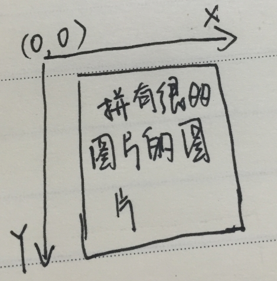
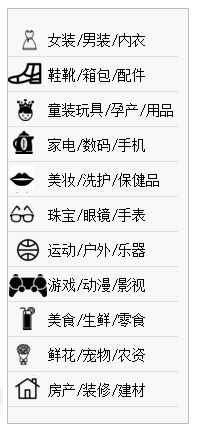

# 雪碧图CSS Sprite的应用

> CSS雪碧，即CSS Sprite，也有人叫它CSS精灵，是一种CSS图像合并技术，该方法是将小图标和背景图像合并到一张图片上，然后利用css的背景定位来显示需要显示的图片部分。例如常见的商品分类导航其实所有商品的背景图用的都是一个所有小图标拼凑成的大图，只是在不同类别显示对应类别的图标时，通过li背景定位到大图的对应图标的位置。背景图位置可以使用一些雪碧图生成工具的时候，生成对应的CSS样式文件里面会有对应的位置信息。

## 好处优点

> 有效减少网站的http请求数量，加速图片的显示。

## 条件

> 静态图片，图片不随用户信息的变化而变化。

> 小图片，容量比较小的(2-3KB)

> 图片加载量比较大的。

> 注意：大图片不建议用雪碧图咯，图片那么大，拼完之后岂不是拆机无敌大咯，加载就慢了，得不偿失！！！

## 原理

> 利用 css3的 background-position控制一个层可显示区域范围大小，通过一个窗口，对背景图进行滑动。
简单来说，就是利用这个属性，设置背景图需要显示的起始位置，在通过标签来控制背景图显示的范围。

## background-position属性



> 根据图所知：

> 以左上角为（0,0）坐标

> x,y都是负值

> 综上所诉，所以background-position的取值就是背景图显示的起始坐标，形式就是background-position：0, 0;

## 拼图

> 拼图可以用ps，或者网上很多在线雪碧图生成工具，可以利用这些去生成雪碧图。

> 其实最好的拼图就是每个图标边距是多少和图标周围的留白留多少都控制好，对css的background-position的坐标写起来有规律的话，好些很多（然而这个是我自己手动拖拉的，位置很没有规律，所以下面的坐标值都是调试过才取值的）


> 讲完这些了，可以来正题了，html和css代码了，下面代码是模仿生成一个菜单~~~

## 代码

```html
<div id="content">
  <ul class="content">
    <li class="cat-1">
      <i></i>
      <h3>女装/男装/内衣</h3>
    </li>
    <li class="cat-2">
      <i></i>
      <h3>鞋靴/箱包/配件</h3>
    </li>
    <li class="cat-3">
      <i></i>
      <h3>童装玩具/孕产/用品</h3>
    </li>
    <li class="cat-4">
      <i></i>
      <h3>家电/数码/手机</h3>
    </li>
    <li class="cat-5">
      <i></i>
      <h3>美妆/洗护/保健品</h3>
    </li>
    <li class="cat-6">
      <i></i>
      <h3>珠宝/眼镜/手表</h3>
    </li>
    <li class="cat-7">
      <i></i>
      <h3>运动/户外/乐器</h3>
    </li>
    <li class="cat-8">
      <i></i>
      <h3>游戏/动漫/影视</h3>
    </li>
    <li class="cat-9">
      <i></i>
      <h3>美食/生鲜/零食</h3>
    </li>
    <li class="cat-10">
      <i></i>
      <h3>鲜花/宠物/农资</h3>
    </li>
    <li class="cat-11">
      <i></i>
      <h3>房产/装修/建材</h3>
    </li>
  </ul>
</div>
```

```css
#content{
  width: 180px;
  background: #f8f8f8;
  border: 1px solid #bbb;
}
h3{
  margin: 0;
  padding: 0;
}
ul{
  list-style: none;
  padding: 0;
}
li h3{
  font-size: 14px;
  font-weight: 400;
}
li{  
  margin:  3px 10px 0 0;
  display: block;
  height: 31px;
  line-height: 31px;
  overflow: hidden;
  border-bottom: 1px solid #dedede;
 
}
li i{
  background:  url(sprite.png);
  display: inline;
  width: 40px;
  height: 28px;
  float: left;
}
.cat-1 i{
  background-position: -7px -5px;
}
.cat-2 i{
  background-position: -2px -35px;
}
.cat-3 i{
  background-position: -7px -65px;
}
.cat-4 i{
  background-position: -7px -105px;
}
.cat-5 i{
  background-position: -7px -129px;
}
.cat-6 i{
  background-position: -7px -151px;
}
.cat-7 i{
  background-position:-60px -4px;
}
.cat-8 i{
  background-position:-56px -33px;
}
.cat-9 i{
  background-position: -56px -66px;
}
.cat-10 i{
  background-position:-60px -103px;
}
.cat-11 i{
  background-position: -51px -128px;
}
```

## 效果图如下



**本文转载自`忆桐之家的博客`，<a href="http://hongyitong.github.io/2016/12/23/雪碧图CSS%20Sprite的应用/" rel="nofollow">《雪碧图CSS Sprite的应用》</a>**