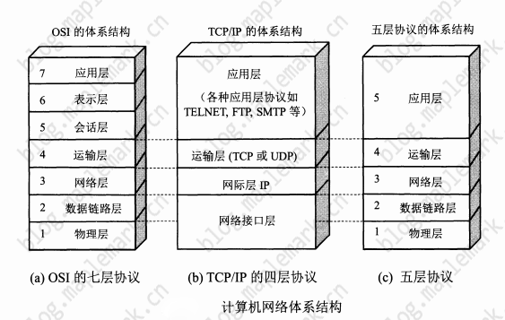
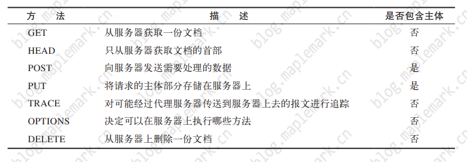
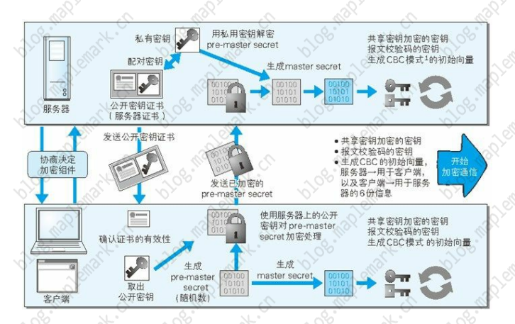
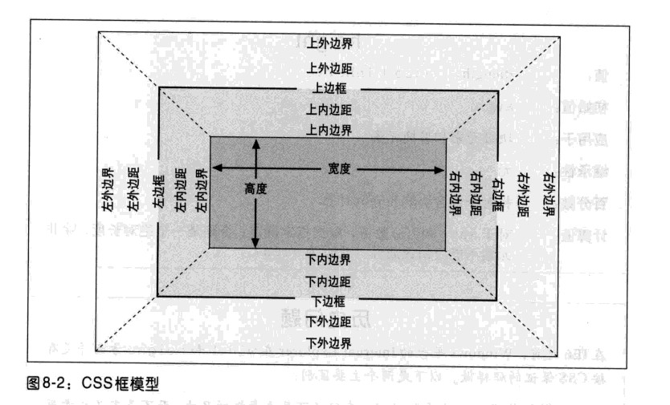

# 问题与简答

## 网络协议篇

### 计算机网络体系结构



#### 各层作用

- 应用层：应用层协议定义的是应用进程间通信和交互的规则
- 运输层：运输层的任务就是负责向`两台主机中进程之间的通信`提供`通用的数据传输`服务
- 网络层：把运输层产生的报文段或用户数据报封装成`分组`或`包`进行传送
- 数据链路层：将网络层交下来的 IP 数据报组装成帧，并在两个相邻结点间的链路上传送
- 物理层：利用物理媒体以`比特`形式传送数据

拓展阅读 [《计算机网络体系结构》](./01.网络协议/01.计算机网络体系结构.md)

### UDP 的主要特点

- UDP 是`无连接的`，即发送数据之前不需要建立连接(发送数据结束时也没有连接可释放)，减少了开销和发送数据之前的时延
- UDP 使用`尽最大努力交付`，即不保证可靠交付，主机不需要维持复杂的连接状态表
- UDP 是`面向报文`的，发送方的 UDP 对应用程序交下来的报文，在添加首部后就向下交付 IP 层。UDP 对应用层交下来的报文，既不合并，也不拆分，而是`保留这些报文的边界`
- UDP `没有拥塞控制`，网络出现的拥塞不会使源主机的发送速率降低。这对某些实时应用是很重要的
- UDP 支持一对一、一对多、多对一和多对多的交互通信
- UDP 的`首部开销小`，只有8个字节，比 TCP 的20个字节的首部要短

拓展阅读 [《用户数据报协议 UDP》](./01.网络协议/02.用户数据报协议UDP.md)

### TCP 的主要特点

- TCP 是`面向连接的运输层协议`。应用程序在使用 TCP 协议之前，必须先建立 TCP 连接。在传送数据完毕后，必须释放已经建立的 TCP 连接
- 每一条 TCP 连接只能有两个`端点`，每一条 TCP 连接只能是`点对点`的(一对一)
- TCP 提供`可靠交付`的服务。通过 TCP 连接传送的数据，无差错、不丢失、不重复，并且按序到达
- TCP 提供`全双工通信`。TCP 允许通信双方的应用进程在任何时候都能发送数据。TCP 连接的两端都设有发送缓存和接受缓存，用来临时存放双向通信的数据
- `面向字节流`。TCP 中的“流”指的是`流入到进程或从进程流出的字节序列`

拓展阅读 [《传输控制协议 TCP》](./01.网络协议/03.传输控制协议TCP.md)

### 简述三报文握手建立 TCP 连接

- 服务器进程先创建传输控制块 TCB，并处于监听状态，等待客户端的连接请求
- 客户端创建传输控制块 TCB，并向服务器发出连接请求报文段
- 服务器收到连接请求报文段后，如同意建立连接，则发送确认报文段
- 客户端进程收到服务器的确认报文段后，立即回复确认报文段，并进入已建立连接状态
- 服务器收到确认报文段之后，也进入已建立连接状态

> 传输控制块 TCB(Transmission Control Block)存储了每一个连接中的一些重要信息

### 建立 TCP 连接为什么最后还要发送确认

这主要是为了防止已失效的连接请求报文段突然又传到了 TCP 服务器，避免产生错误

### 简述 TCP 连接的释放

- 客户端应用进程发出连接释放报文段，并停止再发送数据，进入 FIN-WAIT-1(终止等待1)状态，等待服务器确认
- 服务器收到连接释放报文段后即发出确认，进入 CLOSE-WAIT(关闭等待)状态，服务器若发送数据，客户端扔要接收
- 客户端收到来自服务器的确认后，进入 FIN-WAIT-2(终止等待2)状态，等待服务器发出连接释放报文段
- 服务器没有要发送的数据，发出连接释放报文段，进入 LAST-ACK(最后确认)状态，等待客户端确认
- 客户端收到连接释放报文段后，发出确认，进入 TIME-WAIT(时间等待)状态，经过时间等待计时器设置的时间 2MSL 后，进入 CLOSED(关闭) 状态
- 服务器收到客户端报文段后，进入 CLOSED 状态

### TIME-WAIT 是什么，为什么必须等待 2MLS

TIME-WAIT 是一种 TCP 状态。等待 2MLS 可以保证客户端最后一个报文段能够到达服务器，如果未到达，服务器则会超时重传连接释放报文段，使得客户端、服务器都可以正常进入到 CLOSE(关闭) 状态

### TCP 粘包问题

#### 粘包问题

在 TCP 这种字节流协议上做`应用层分包`是网络编程的基本需求。分包指的是在发生一个消息(message)或一帧(frame)数据时，通过一定的处理，让接收方能从字节流中识别并截取(还原)出一个个消息。因此，“粘包问题”是个伪命题

#### 长连接分包

- 消息长度固定
- 使用特殊的字符或字符串作为消息的边界，例如 HTTP 协议的 headers 以“\r\n”为字段的分隔符
- 在每条消息的头部加一个长度字段，这恐怕是最常见的做法
- 利用消息本身的格式来分包，例如 XML 格式的消息中 `<root>`...`</root>` 的配对，或者 JSON 格式中的 { ... } 的配对。解析这种消息格式通常会用到状态机(state machine)

拓展阅读 [《TCP粘包拆包》](./01.网络协议/04.TCP粘包拆包.md)

### UDP、TCP 区别，适用场景

|对比项|UDP|TCP|
|-|-|-|
|连接性|无连接|面向连接|
|可靠性|不可靠|可靠|
|报文|面向报文-数据报模式|面向字节流-流模式|
|双工性|一对一、一对多、多对一、多对多|全双工|
|流量控制|无|有(滑动窗口)|
|拥塞控制|无|有(慢开始、拥塞避免、快重传、快恢复)|
|传输速度|快|慢|
|资源要求|较少|较多|
|首部开销|8字节|20字节|
|数据顺序|不保证|保证|

#### UDP 适用场景

面向数据报方式、网络数据大多为短消息、拥有大量 Client、对数据安全性无特殊要求、网络负担非常重，但对响应速度要求高

#### TCP 适用场景

文件传输(FTP HTTP 对数据准确性要求较高，速度可以相对慢)
发送或接收邮件(POP IMAP SMTP 对数据准确性要求高，非紧急应用)
远程登录(telnet SSH 对数据准确性有要求，有连接的概念)

### 建立 socket 需要哪些步骤

- 创建 socket
- 绑定 socket 到指定地址和端口
- 开始监听连接
- 读取客户端输入
- 关闭 socket

### DNS 主要作用是什么

计算机既可以被赋予 IP 地址，也可以被赋予主机名和域名。用户通常使用主机名或域名来访问对方的计算机，而不是直接通过 IP 地址访问

但要让计算机去理解名称，相对而言就变得困难，因为计算机更擅长处理一长串数字

为了解决上述问题，DNS 服务应运而生。DNS 协议提供通过域名查找 IP 地址，或逆向从 IP 地址反查域名的服务

### HTTP 报文组成

HTTP 报文是由简单字符串组成，HTTP 报文都是纯文本，不是二进制代码，可以很方便地对其进行读写


从客户端发往服务器的 HTTP 报文称为`请求报文`(request message)。从服务器发往客户端的报文称为`响应报文`(response message)。HTTP 请求和响应报文的格式很类似

HTTP 报文组成部分

- 起始行：报文的第一行就是起始行，在请求报文中用来说明要做些什么，在响应报文中说明出现了什么情况
- 首部字段：起始行后面有零个或多个首部字段。每个首部字段都包含一个名字和一个值
- 主体：空行之后就是可选的报文主体了，其中包含了所有类型的数据

### HTTP 状态码

> HTTP 状态码用来告诉客户端，发生了什么事情，状态码位于响应的起始行中

#### 状态码分类

|状态码|整体范围|已定义范围|分类|
|-|-|-|-|
|1XX|100~199|100~101|信息提示|
|2XX|200~299|200~206|成功|
|3XX|300~399|300~305|重定向|
|4XX|400~499|400~415|客户端错误|
|5XX|500~599|500~505|服务器错误|

#### 常见状态码

|状态码|原因短语|含义|考察概率|
|-|-|-|-|
|100|Continue|收到了请求的初始部分，请客户端继续||
|101|Switching Protocols|正在将协议切换成客户端指定协议||
|200|OK|请求没有问题|***|
|201|Created|用于创建服务器对象的请求||
|202|Accepted|请求已接收，服务器还未执行操作||
|203|Non-Authoritative Information|实体首部包含信息来自资源副本||
|204|No Content|响应报文中没有实体的主体部分||
|205|Reset Content|告知浏览器清除 HTML 表单元素||
|206|Partial Content|部分或 Range(范围) 请求|*|
|300|Multiple Choices|请求指向多个资源的链接||
|301|Moved Permanently|在请求的链接被移除时使用|**|
|302|Found|在请求临时的链接使用|**|
|303|See Other|告知使用另外一个链接来获取资源||
|304|Not Modified|资源未被修改可使用旧资源|**|
|305|Use Proxy|必须使用代理来访问资源||
|307|Temporary Redirect|在请求临时的链接使用|**|
|400|Bad Request|告知客户端发送了错误请求|***|
|401|Unauthorized|获取资源许先进行认证||
|403|Forbidden|请求被服务器拒绝|***|
|404|Not Found|无法找到所请求的 URL|***|
|405|Method Not Allowed|不支持该请求方法||
|406|Not Acceptable|无可接受实体||
|408|Request Timeout|完成请求耗时太长服务器关闭连接||
|409|Conflict|请求可能在资源上引发冲突||
|500|Internal Server Error|服务器遇到错误|***|
|501|Not Implemented|请求超过服务器的能力范围||
|502|Bad Gateway|代理或网关错误(无法连接到其父网关)|***|
|503|Service Unavailable|无法为请求提供服务|***|
|504|Gateway Timeout|代理或网关超时(等待另一服务器响应超时)|***|

拓展阅读 [《HTTP状态码》](./01.网络协议/05.HTTP状态码.md)

### 常见的 HTTP 方法



拓展阅读 [《HTTP方法详解》](./01.网络协议/06.HTTP方法详解.md)

### GET 与 POST 请求方式区别

|GET|POST|
|-|-|
|后退按钮/刷新无害|数据会被重新提交|
|数据长度限制/URL长度2048字符|长度无限制|
|数据可见/安全性差|不可见/更安全|
|可以被缓存|不可以被缓存|
|书签可收藏|书签不可收藏|

### HTTP 优缺点

基于应用级的接口，使用方便

传输速度慢，数据包大；如实现实时交互，服务器性能压力大；数据传输安全性差

### HTTPS 通信原理



拓展阅读 [《HTTPS细节介绍》](./01.网络协议/07.HTTPS细节介绍.md)

拓展阅读 [《SSL/TLS协议运行机制的概述》](./01.网络协议/08.SSL-TLS协议运行机制的概述.md)

### HTTP 2.0

多路复用、客户端拉拽/服务器推送、流量控制、WebSocket

### IPv6 与 IPv4 有什么变化

更大的地址空间、扩展的地址层次结构、灵活的首部格式、改进的选项、允许协议继续扩充、支持资源的预分配

### 什么是心跳机制

心跳机制是定时发送一个自定义的结构体(心跳包)，让对方知道自己还活着，以确保连接的有效性的机制

### 什么是长连接

长连接，指在一个连接上可以连续发送多个数据包，在连接保持期间，如果没有数据包发送，需要双方发链路检测包

## 数据结构与算法篇

### 衡量、比较算法优劣的指标

> 空间复杂度S(n)、时间复杂度T(n)

### 链表有哪些

> 单向链表、双向链表、循环链表

### 线性结构

- 线性表

> 线性表是由同一类型的数据元素构成的有序序列的线性结构

> 实现方式: 线性存储、链式存储

- 堆栈

> 堆栈可以认为是具有一定约束的线性表，插入和删除操作都作用在一个称为栈顶的端点位置

- 队列

> 队列是一个有序线性表，但队列的插入和删除是分别在线性表的两个不同端点进行的

### 树

- 查找

> 顺序查找、二分查找

- 二叉树

- 二叉搜索树

- 平衡二叉树

### 散列查找

- 散列表

- 散列函数的构造方法

> 数字型关键字、字符串关键字

- 处理冲突的方法

> 开放地址法、链地址法

### 排序

- 选择排序

> 简单选择排序、堆排序

- 插入排序

> 简单插入排序、希尔排序

- 交换排序

> 冒泡排序、快速排序

- 归并排序

- 基数排序

> 桶排序、基数排序

### 跳跃表

### 其他

- KPM

- 布隆过滤器

- 贪心算法

- 回溯算法

- 动态规划

- 最小生成树

- 最短路径

- 推荐算法

- 深度优先、广度优先

## PHP 篇

### echo、print、print_r、var_dump 区别

> `echo`和`print`是语言结构、`print_r`和`var_dump`是普通函数

- echo：输出一个或多个字符串

- print：输出字符串

- print_r：打印关于变量的易于理解的信息

- var_dump：打印关于变量的易于理解的信息(带类型)

拓展阅读 [《echo、print、print_r、var_dump区别》](./03.PHP/03.echo、print、print_r、var_dump区别.md)

### 单引号和双引号的区别

双引号可以被分析器解析，单引号则不行

### isset 和 empty 的区别

isset：检测变量是否已设置并且非 NULL

empty：判断变量是否为空，变量为 0/false 也会被认为是空；变量不存在，不会产生警告

### static、self、$this 的区别

static：static 可以用于静态或非静态方法中，也可以访问类的静态属性、静态方法、常量和非静态方法，但不能访问非静态属性

self：可以用于访问类的静态属性、静态方法和常量，但 self 指向的是当前定义所在的类，这是 self 的限制

$this：指向的是实际调用时的对象，也就是说，实际运行过程中，谁调用了类的属性或方法，$this 指向的就是哪个对象。但 $this 不能访问类的静态属性和常量，且 $this 不能存在于静态方法中

### include、require、include_once、require_once 的区别

require 和 include 几乎完全一样，除了处理失败的方式不同之外。require 在出错时产生 E_COMPILE_ERROR 级别的错误。换句话说将导致脚本中止而 include 只产生警告（E_WARNING），脚本会继续运行

include_once 语句在脚本执行期间包含并运行指定文件。此行为和 include 语句类似，唯一区别是如果该文件中已经被包含过，则不会再次包含。如同此语句名字暗示的那样，只会包含一次

### 常见数组函数

array_count_values — 统计数组中所有的值

array_flip — 交换数组中的键和值

array_merge — 合并一个或多个数组

array_multisort — 对多个数组或多维数组进行排序

array_pad — 以指定长度将一个值填充进数组

array_pop — 弹出数组最后一个单元(出栈)

array_push — 将一个或多个单元压入数组的末尾(入栈)

array_rand — 从数组中随机(伪随机)取出一个或多个单元

array_keys — 返回数组中部分的或所有的键名

array_values — 返回数组中所有的值

count — 计算数组中的单元数目，或对象中的属性个数

sort — 对数组排序

### Cookie 和 Session

Cookie：PHP 透明的支持 HTTP cookie 。cookie 是一种远程浏览器端存储数据并以此来跟踪和识别用户的机制

Session：会话机制(Session)在 PHP 中用于保持用户连续访问Web应用时的相关数据

### 预定义变量

对于全部脚本而言，PHP 提供了大量的预定义变量

超全局变量 — 超全局变量是在全部作用域中始终可用的内置变量

```text
$GLOBALS — 引用全局作用域中可用的全部变量
$_SERVER — 服务器和执行环境信息
$_GET — HTTP GET 变量
$_POST — HTTP POST 变量
$_FILES — HTTP 文件上传变量
$_REQUEST — HTTP Request 变量
$_SESSION — Session 变量
$_ENV — 环境变量
$_COOKIE — HTTP Cookies
$php_errormsg — 前一个错误信息
$HTTP_RAW_POST_DATA — 原生POST数据
$http_response_header — HTTP 响应头
$argc — 传递给脚本的参数数目
$argv — 传递给脚本的参数数组
```

- 超全局变量

PHP 中的许多预定义变量都是“超全局的”，这意味着它们在一个脚本的全部作用域中都可用。在函数或方法中无需执行 global $variable; 就可以访问它们

超全局变量：$GLOBALS、$\_SERVER、$\_GET、$\_POST、$\_FILES、$\_COOKIE、$\_SESSION、$\_REQUEST、$\_ENV

### 传值和传引用的区别

传值导致对象生成了一个拷贝，传引用则可以用两个变量指向同一个内容

### 构造函数和析构函数

构造函数：PHP 5 允行开发者在一个类中定义一个方法作为构造函数。具有构造函数的类会在每次创建新对象时先调用此方法，所以非常适合在使用对象之前做一些初始化工作

析构函数：PHP 5 引入了析构函数的概念，这类似于其它面向对象的语言，如 C++。析构函数会在到某个对象的所有引用都被删除或者当对象被显式销毁时执行

### 魔术方法

\_\_construct()， \_\_destruct()， \_\_call()， \_\_callStatic()， \_\_get()， \_\_set()， \_\_isset()， \_\_unset()， \_\_sleep()， \_\_wakeup()， \_\_toString()， \_\_invoke() 等方法在 PHP 中被称为"魔术方法"（Magic methods）

### public、protected、private、final 区别

对属性或方法的访问控制，是通过在前面添加关键字 public（公有），protected（受保护）或 private（私有）来实现的。被定义为公有的类成员可以在任何地方被访问

PHP 5 新增了一个 final 关键字。如果父类中的方法被声明为 final，则子类无法覆盖该方法。如果一个类被声明为 final，则不能被继承

### 客户端/服务端 IP 获取，了解代理透传 实际IP 的概念

客户端IP: $\_SERVER['REMOTE_ADDR']

服务端IP: $\_SERVER['SERVER_ADDR']

客户端IP(代理透传): $\_SERVER['HTTP_X_FORWARDED_FOR']

### 类的静态调用和实例化调用

- 占用内存

静态方法在内存中只有一份，无论调用多少次，都是共用的

实例化不一样，每一个实例化是一个对象，在内存中是多个的

- 不同点

静态调用不需要实例化即可调用

静态方法不能调用非静态属性，因为非静态属性需要实例化后，存放在对象里

静态方法可以调用非静态方法，使用 self 关键字。php 里，一个方法被 `self::` 后，自动转变为静态方法

调用类的静态函数时不会自动调用类的构造函数

### PHP 不实例化调用方法

静态调用、使用 PHP 反射方式

### php.ini 配置选项

- 配置选项

|名字|默认|备注|
|-|-|-|
|short_open_tag|"1"|是否开启缩写形式(`<? ?>`)|
|precision|"14"|浮点数中显示有效数字的位数|
|disable_functions|""|禁止某些函数|
|disable_classes|""|禁用某些类|
|expose_php|""|是否暴露 PHP 被安装在服务器上|
|max_execution_time|30|最大执行时间|
|memory_limit|128M|每个脚本执行的内存限制|
|error_reporting|NULL|设置错误报告的级别 `E_ALL` & ~`E_NOTICE` & ~`E_STRICT` & ~`E_DEPRECATED`|
|display_errors|"1"|显示错误|
|log_errors|"0"|设置是否将错误日志记录到 error_log 中|
|error_log|NULL|设置脚本错误将被记录到的文件|
|upload_max_filesize|"2M"|最大上传文件大小|
|post_max_size|"8M"|设置POST最大数据限制|

```shell
php -ini | grep short_open_tag //查看 php.ini 配置
```

- 动态设置

```php
ini_set(string $varname , string $newvalue);

ini_set('date.timezone', 'Asia/Shanghai'); //设置时区
ini_set('display_errors', '1'); //设置显示错误
ini_set('memory_limit', '256M'); //设置最大内存限制
```

### php-fpm.conf 配置

|名称|默认|备注|
|-|-|-|
|pid||PID文件的位置|
|error_log||错误日志的位置|
|log_level|notice|错误级别 alert:必须立即处理、error:错误情况、warning:警告情况、notice:一般重要信息、debug:调试信息|
|daemonize|yes|设置 FPM 在后台运行|
|listen|ip:port、port、/path/to/unix/socket|设置接受 FastCGI 请求的地址|
|pm|static、ondemand、dynamic|设置进程管理器如何管理子进程|
|request_slowlog_timeout|'0'|慢日志记录阀值|
|slowlog||慢请求的记录日志|

### 502、504 错误产生原因及解决方式

#### 502

502 表示网关错误，当 PHP-CGI 得到一个无效响应，网关就会输出这个错误

- `php.ini` 的 memory_limit 过小
- `php-fpm.conf` 中 max_children、max_requests 设置不合理
- `php-fpm.conf` 中 request_terminate_timeout、max_execution_time 设置不合理
- php-fpm 进程处理不过来，进程数不足、脚本存在性能问题

#### 504

504 表示网关超时，PHP-CGI 没有在指定时间响应请求，网关将输出这个错误

- Nginx+PHP 架构，可以调整 FastCGI 超时时间，fastcgi_connect_timeout、fastcgi_send_timeout、fastcgi_read_timeout

### 如何返回一个301重定向

```php
header('HTTP/1.1 301 Moved Permanently');
header('Location: https://blog.maplemark.cn');
```

### PHP 与 MySQL 连接方式

#### MySQL

```php
$conn = mysql_connect('127.0.0.1:3306', 'root', '123456');
if (!$conn) {
    die(mysql_error() . "\n");
}
mysql_query("SET NAMES 'utf8'");
$select_db = mysql_select_db('app');
if (!$select_db) {
    die(mysql_error() . "\n");
}
$sql = "SELECT * FROM `user` LIMIT 1";
$res = mysql_query($sql);
if (!$res) {
    die(mysql_error() . "\n");
}
while ($row = mysql_fetch_assoc($res)) {
    var_dump($row);
}
mysql_close($conn);
```

#### MySQLi

```php
$conn = @new mysqli('127.0.0.1:3306', 'root', '123456');
if ($conn->connect_errno) {
    die($conn->connect_error . "\n");
}
$conn->query("set names 'utf8';");
$select_db = $conn->select_db('user');
if (!$select_db) {
    die($conn->error . "\n");
}
$sql = "SELECT * FROM `user` LIMIT 1";
$res = $conn->query($sql);
if (!$res) {
    die($conn->error . "\n");
}
while ($row = $res->fetch_assoc()) {
    var_dump($row);
}
$res->free();
$conn->close();
```

#### PDO

```php
$pdo = new PDO('mysql:host=127.0.0.1:3306;dbname=user', 'root', '123456');
$pdo->exec("set names 'utf8'");
$sql = "SELECT * FROM `user` LIMIT 1";
$stmt = $pdo->prepare($sql);
$stmt->bindValue(1, 1, PDO::PARAM_STR);
$rs = $stmt->execute();
if ($rs) {
    while ($row = $stmt->fetch(PDO::FETCH_ASSOC)) {
        var_dump($row);
    }
}
$pdo = null;
```

### MySQL、MySQLi、PDO 区别

#### MySQL

- 允许 PHP 应用与 MySQL 数据库交互的早期扩展
- 提供了一个面向过程的接口，不支持后期的一些特性

#### MySQLi

- 面向对象接口
- prepared 语句支持
- 多语句执行支持
- 事务支持
- 增强的调试能力

#### PDO

- PHP 应用中的一个数据库抽象层规范
- PDO 提供一个统一的 API 接口，无须关心数据库类型
- 使用标准的 PDO API，可以快速无缝切换数据库

### 数据库持久连接

把 PHP 用作多进程 web 服务器的一个模块，这种方法目前只适用于 Apache。

对于一个多进程的服务器，其典型特征是有一个父进程和一组子进程协调运行，其中实际生成 web 页面的是子进程。每当客户端向父进程提出请求时，该请求会被传递给还没有被其它的客户端请求占用的子进程。这也就是说当相同的客户端第二次向服务端提出请求时，它将有可能被一个不同的子进程来处理。在开启了一个持久连接后，所有请求 SQL 服务的后继页面都能够重用这个已经建立的 SQL Server 连接。

### 代码执行过程

PHP 代码 => 启动 php 及 zend 引擎，加载注册拓展模块 => 对代码进行词法/语法分析 => 编译成opcode(opcache) => 执行 opcode

> PHP7 新增了抽象语法树(AST)，在语法分析阶段生成 AST，然后再生成 opcode 数组

### base64 编码原理


### ip2long 实现


### MVC 的理解

MVC 包括三类对象。模型 Model 是应用对象，视图 View 是它在屏幕上的表示，控制器 Controller 定义用户界面对用户输入的响应方式。不使用 MVC，用户界面设计往往将这些对象混在一起，而 MVC 则将它们分离以提高灵活性和复用性

### 主流 PHP 框架特点

#### Laravel

易于访问，功能强大，并提供大型，强大的应用程序所需的工具

- 简单快速的路由引擎
- 强大的依赖注入容器
- 富有表现力，直观的数据库 ORM
- 提供数据库迁移功能
- 灵活的任务调度器
- 实时事件广播

#### Symfony

- Database engine-independent
- Simple to use, in most cases, but still flexible enough to adapt to complex cases
- Based on the premise of convention over configuration--the developer needs to configure only the unconventional
- Compliant with most web best practices and design patterns
- Enterprise-ready--adaptable to existing information technology (IT) policies and architectures, and stable enough for long-term projects
- Very readable code, with phpDocumentor comments, for easy maintenance
- Easy to extend, allowing for integration with other vendor libraries

#### CodeIgniter

- 基于模型-视图-控制器的系统
- 框架比较轻量
- 全功能数据库类，支持多个平台
- Query Builder 数据库支持
- 表单和数据验证
- 安全性和 XSS 过滤
- 全页面缓存

#### ThinkPHP

- 采用容器统一管理对象
- 支持 Facade
- 更易用的路由
- 注解路由支持
- 路由跨域请求支持
- 验证类增强
- 配置和路由目录独立
- 取消系统常量
- 类库别名机制
- 模型和数据库增强
- 依赖注入完善
- 支持 PSR-3 日志规范
- 中间件支持
- 支持 Swoole/Workerman 运行

### 对象关系映射/ORM

#### 优点

- 缩短编码时间、减少甚至免除对 model 的编码，降低数据库学习成本
- 动态的数据表映射，在表结构发生改变时，减少代码修改
- 可以很方便的引入附加功能(cache 层)

#### 缺点

- 映射消耗性能、ORM 对象消耗内存
- SQL 语句较为复杂时，ORM 语法可读性不高(使用原生 SQL)

### 链式调用实现

类定义一个内置变量，让类中其他定义方法可访问到

### 异常处理

set_exception_handler — 设置用户自定义的异常处理函数

使用 try / catch 捕获

### 如何实现异步调用

```php
$fp = fsockopen("blog.maplemark.cn", 80, $errno, $errstr, 30);
if (!$fp) {
    echo "$errstr ($errno)<br />\n";
} else {
    $out = "GET /backend.php  / HTTP/1.1\r\n";
    $out .= "Host: blog.maplemark.cn\r\n";
    $out .= "Connection: Close\r\n\r\n";
    fwrite($fp, $out);
    /*忽略执行结果
    while (!feof($fp)) {
        echo fgets($fp, 128);
    }*/
    fclose($fp);
}
```

### 多进程同时写一个文件

加锁、队列

### PHP 进程模型，进程通讯方式，进程线程区别

消息队列、socket、信号量、共享内存、信号、管道

### PHP 支持回调的函数，实现一个

array_map、array_filter、array_walk、usort

is_callable + callbacks + 匿名函数实现

### 发起 HTTP 请求有哪几种方式，它们有何区别

cURL、file_get_contents、fopen、fsockopen

### php for while foreach 迭代数组时候，哪个效率最高

### 弱类型变量如何实现

PHP 中声明的变量，在 zend 引擎中都是用结构体 zval 来保存，通过共同体实现弱类型变量声明

### PHP 拓展初始化

- 初始化拓展

```shell
$ php /php-src/ext/ext_skel.php --ext
```

- 定义拓展函数

zend_module_entry 定义 Extension name 编写 PHP_FUNCTION 函数

- 编译安装

```shell
$ phpize $ ./configure $ make && make install
```

### 如何获取扩展安装路径

### 垃圾回收机制

引用计数器

### Trait

自 PHP 5.4.0 起，PHP 实现了一种代码复用的方法，称为 trait

### yield 是什么，说个使用场景 yield、yield 核心原理是什么

一个生成器函数看起来像一个普通的函数，不同的是普通函数返回一个值，而一个生成器可以yield生成许多它所需要的值

### traits 与 interfaces 区别 及 traits 解决了什么痛点

### 如何 foreach 迭代对象、如何数组化操作对象 $obj[key]、如何函数化对象 $obj(123);

### Swoole 适用场景，协程实现方式

那你知道swoole的进程模型

### PHP 数组底层实现 （HashTable + Linked list）

### Copy on write 原理，何时 GC

### 如何解决 PHP 内存溢出问题

### ZVAL
https://github.com/xianyunyh/PHP-Interview/blob/master/PHP/PHP-Zval%E7%BB%93%E6%9E%84.md

### HashTable
https://github.com/xianyunyh/PHP-Interview/blob/master/PHP/PHP7-HashTable.md

### PHP7 新特性

标量类型声明、返回值类型声明、通过 define() 定义常量数组、匿名类、相同命名空间类一次性导入

### PHP7 底层优化

ZVAL 结构体优化，占用由24字节降低为16字节

内部类型 zend_string，结构体成员变量采用 char 数组，不是用 char*

PHP 数组实现由 hashtable 变为 zend array

函数调用机制，改进函数调用机制，通过优化参数传递环节，减少了一些指令

https://github.com/xianyunyh/PHP-Interview/blob/master/PHP/php7.md

### PSR 介绍，PSR-1, 2, 4, 7

### Xhprof 、Xdebug 性能调试工具使用

### 字符串、数字比较大小的原理，注意 0 开头的8进制、0x 开头16进制

### BOM 头是什么，怎么除去

### 模板引擎是什么，解决什么问题、实现原理（Smarty、Twig、Blade）

## Web 篇

### SEO 有哪些需要注意的

合理的 title、description、keywords

语义化的 HTML 代码，符合 W3C 规范：语义化代码让搜索引擎容易理解网页

重要内容 HTML 代码放在最前：搜索引擎抓取 HTML 顺序是从上到下，有的搜索引擎对抓取长度有限制，保证重要内容一定会被抓取

重要内容不要用 js 输出：爬虫不会执行 js 获取内容

少用 iframe：搜索引擎不会抓取 iframe 中的内容

非装饰性图片必须加 alt

提高网站速度：网站速度是搜索引擎排序的一个重要指标

拓展阅读[《初探 SEO》](./04.Web/01.初探SEO.md)

### img 标签的 title 和 alt 有什么区别

title 属性规定关于元素的额外信息，这些信息通常会在鼠标移到元素上时显示一段提示文本

alt 是标签的特有属性，是图片内容的等价描述。图片无法加载时显示。搜索引擎会重点分析

### CSS 选择器的分类


拓展阅读[《CSS选择器的分类》](./04.Web/02.CSS选择器的分类.md)

### CSS sprite 是什么，有什么优缺点

概念：将多个小图片拼接到一个图片中。通过 background-position 和元素尺寸调节需要显示的背景图案。

- 优点

减少 HTTP 请求数，极大地提高页面加载速度

增加图片信息重复度，提高压缩比，减少图片大小

更换风格方便，只需在一张或几张图片上修改颜色或样式即可实现

- 缺点

图片合并麻烦

维护麻烦，修改一个图片可能需要从新布局整个图片，样式

拓展阅读[《雪碧图CSS Sprite的应用》](./04.Web/03.CSS-Sprite的应用.md)

### display: none 与 visibility: hidden 的区别

- 用途

通过为属性设置一个值来影响用户代理显示的方式

- 区别

display:none 会让元素完全从渲染树中消失，渲染的时候不占据任何空间；visibility: hidden 不会让元素从渲染树消失，渲染师元素继续占据空间，只是内容不可见

display: none 是非继承属性，子孙节点消失由于元素从渲染树消失造成，通过修改子孙节点属性无法显示；visibility: hidden 是继承属性，子孙节点消失由于继承了hidden，通过设置visibility: visible 可以让子孙节点显式

修改常规流中元素的 display 通常会造成文档重排。修改 visibility 属性只会造成本元素的重绘

读屏器不会读取 display: none 元素内容；会读取 visibility: hidden 元素内容

### display: block 和 display: inline 的区别

- block 元素特点

处于常规流中时，如果 width 没有设置，会自动填充满父容器

可以应用 margin/padding

在没有设置高度的情况下会扩展高度以包含常规流中的子元素 

处于常规流中时布局时在前后元素位置之间（独占一个水平空间）

忽略 vertical-align

- inline 元素特点

水平方向上根据 direction 依次布局

不会在元素前后进行换行

受 white-space 控制

margin/padding 在竖直方向上无效，水平方向上有效

width/height 属性对非替换行内元素无效，宽度由元素内容决定

非替换行内元素的行框高由 line-height 确定，替换行内元素的行框高由 height,margin,padding,border 决定

浮动或绝对定位时会转换为 block

vertical-align 属性生效

### CSS 文件、style 标签、行内 style 属性优先级

最近的祖先样式比其他祖先样式优先级高

"直接样式"比"祖先样式"优先级高

### link 与 @import 的区别

link 是 HTML 方式， @import 是 CSS 方式

link 最大限度支持并行下载，@import 过多嵌套导致串行下载，出现FOUC

link 可以通过 rel="alternate stylesheet"指定候选样式

浏览器对 link 支持早于 @import，可以使用 @import 对老浏览器隐藏样式

@import 必须在样式规则之前，可以在 css 文件中引用其他文件

总体来说：link 优于 @import

### 盒子模型



具备属性：内容(content)、填充(padding)、边框(border)、边界(margin)

拓展阅读[《CSS盒模型》](./04.Web/04.CSS盒模型.md)

### 容器包含若干浮动元素时如何清理(包含)浮动

容器元素闭合标签前添加额外元素并设置clear: both

父元素触发块级格式化上下文(见块级可视化上下文部分)

设置容器元素伪元素进行清理推荐的清理浮动方法

```html
/**
* 在标准浏览器下使用
* 1 content内容为空格用于修复opera下文档中出现
*   contenteditable属性时在清理浮动元素上下的空白
* 2 使用display使用table而不是block：可以防止容器和
*   子元素top-margin折叠,这样能使清理效果与BFC，IE6/7
*   zoom: 1;一致
**/
.clearfix:before,
.clearfix:after {
    content: " "; /* 1 */
    display: table; /* 2 */
}
.clearfix:after {
    clear: both;
}
```

### 如何水平居中一个元素

被设置元素为文本、图片等行内元素时，水平居中是通过给父元素设置 text-align:center 来实现的

定宽和块状可以通过设置 “左右margin” 值为 “auto” 实现居中

不定宽块状使用 float:left 实现居中

拓展阅读[《CSS 水平居中设置》](./04.Web/05.CSS水平居中设置.md)

### 如何竖直居中一个元素

父元素高度确定的单行文本

父元素高度确定的多行文本

拓展阅读[《CSS 垂直居中设置》](./04.Web/06.CSS垂直居中设置.md)

### flex 与 CSS 盒子模型有什么区别

布局的传统解决方案，基于盒状模型，依赖 display 属性 + position属性 + float属性。它对于那些特殊布局非常不方便，比如，垂直居中就不容易实现

Flex 布局，可以简便、完整、响应式地实现各种页面布局。目前，它已经得到了所有浏览器的支持，这意味着，现在就能很安全地使用这项功能

拓展阅读 [《flex 布局的基本概念》](./04.Web/07.flex布局的基本概念.md)

### Position 属性

|值|描述|
|-|-|
|absolute|生成绝对定位的元素，相对于 static 定位以外的第一个父元素进行定位。元素的位置通过 "left", "top", "right" 以及 "bottom" 属性进行规定|
|fixed|生成绝对定位的元素，相对于浏览器窗口进行定位。元素的位置通过 "left", "top", "right" 以及 "bottom" 属性进行规定|
|relative|生成相对定位的元素，相对于其正常位置进行定位。因此，"left:20" 会向元素的 LEFT 位置添加 20 像素|
|static|默认值。没有定位，元素出现在正常的流中（忽略 top, bottom, left, right 或者 z-index 声明）|
|inherit|规定应该从父元素继承 position 属性的值|

拓展阅读 [《CSS Position学习》](./04.Web/08.CSS-Position学习.md)

### PNG,GIF,JPG 的区别及如何选

- GIF

8位像素，256色；无损压缩；支持简单动画；支持boolean透明；适合简单动画

- JPEG

颜色限于256；有损压缩；可控制压缩质量；不支持透明；适合照片

- PNG

有PNG8和truecolor PNG；PNG8类似GIF颜色上限为256，文件小，支持alpha透明度，无动画；适合图标、背景、按钮

### 为什么把 JavaScript 文件放在 Html 底部

脚本会阻塞页面其他资源的下载，因此推荐将所有`<script>`标签尽可能放到`<body>`标签的底部，以尽量减少对整个页面下载的影响

拓展阅读 [《JavaScript 的性能优化：加载和执行》](./04.Web/09.JavaScript的性能优化-加载和执行.md)

### JavaScript 数据类型


拓展阅读 [《JavaScript 数据类型和数据结构》](./04.Web/10.JavaScript数据类型和数据结构.md)

### JavaScript 操作 DOM 的方法有哪些

获取节点的方法getElementById、getElementsByClassName、getElementsByTagName、 getElementsByName、querySelector、querySelectorAll,对元素属性进行操作的 getAttribute、 setAttribute、removeAttribute方法，对节点进行增删改的appendChild、insertBefore、replaceChild、removeChild、 createElement等

拓展阅读 [《JavaScript操作DOM常用的API》](./04.Web/11.JavaScript操作DOM常用的API.md)

### JavaScript 字符串方法有哪些

简单分为获取类方法，获取类方法有charAt方法用来获取指定位置的字符，获取指定位置字符的unicode编码的charCodeAt方法， 与之相反的fromCharCode方法，通过传入的unicode返回字符串。查找类方法有indexof()、lastIndexOf()、search()、match() 方法。截取类的方法有substring、slice、substr三个方法，其他的还有replace、split、toLowerCase、toUpperCase方法

### JavaScript 字符串截取方法有哪些？有什么区别

js字符串截取方法有substring、slice、substr三个方法，substring和slice都是指定截取的首尾索引值，不同的是传递负值的时候 substring会当做0来处理，而slice传入负值的规则是-1指最后一个字符，substr方法则是第一个参数是开始截取的字符串，第二个是截取的字符数量， 和slice类似，传入负值也是从尾部算起的

### setTimeout 和 setInterval 的区别

setTimeout表示间隔一段时间之后执行一次调用，而setInterval则是每间隔一段时间循环调用，直至clearInterval结束。 内存方面，setTimeout只需要进入一次队列，不会造成内存溢出，setInterval因为不计算代码执行时间，有可能同时执行多次代码， 导致内存溢出

### 使用 new 操作符实例化一个对象的具体步骤

- 构造一个新的对象

- 将构造函数的作用域赋给新对象（也就是说this指向了新的对象）

- 执行构造函数中的代码

- 返回新对象

### 如何实现 ajax 请求

通过实例化一个XMLHttpRequest对象得到一个实例，调用实例的open方法为这次 ajax请求设定相应的http方法、相应的地址和以及是否异步，当然大多数情况下我们都是选异步， 以异步为例，之后调用send方法ajax请求，这个方法可以设定需要发送的报文主体，然后通过 监听readystatechange事件，通过这个实例的readyState属性来判断这个ajax请求的状态，其中分为0,1,2,3,4这四种 状态，当状态为4的时候也就是接收数据完成的时候，这时候可以通过实例的status属性判断这个请求是否成功

```javascript
var xhr = new XMLHttpRequest();
xhr.open('get', 'aabb.php', true);
xhr.send(null);
xhr.onreadystatechange = function() {
  if(xhr.readyState==4) {
    if(xhr.status==200) {
      console.log(xhr.responseText);
    }
  }
}
```

### 同源策略是什么

同源策略是指只有具有相同源的页面才能够共享数据，比如cookie，同源是指页面具有相同的协议、域名、端口号，有一项不同就不是同源。 有同源策略能够保证web网页的安全性

拓展阅读 [《浏览器的同源策略》](./04.Web/12.浏览器的同源策略.md)

### 如何解决跨域问题

- 通过 JSONP 跨域
- document.domain + iframe 跨域
- location.hash + iframe
- window.name + iframe 跨域
- postMessage 跨域
- 跨域资源共享（CORS）
- nginx 代理跨域
- nodejs 中间件代理跨域
- WebSocket 协议跨域

拓展阅读 [《前端常见跨域解决方案》](./04.Web/13.前端常见跨域解决方案.md)

### 引起内存泄漏的操作有哪些

- 全局变量引起

- 闭包引起

- dom清空，事件未清除

- 子元素存在引用

- 被遗忘的计时器

### 闭包理解及应用

闭包是函数和声明该函数的词法环境的组合

应用

- 定义事件行为

- 模拟私有方法，用于定义公共函数

拓展阅读 [《JavaScript闭包》](./04.Web/14.JavaScript闭包.md)

### 对 JavaScript 原型的理解

我们知道在es6之前，js没有类和继承的概念，js是通过原型来实现继承的。在js中一个构造函数默认自带有一个prototype属性， 这个的属性值是一个对象，同时这个prototype对象自带有一个constructor属性，这个属性指向这个构造函数，同时每一个实例 都有一个__proto__属性指向这个prototype对象，我们可以将这个叫做隐式原型，我们在使用一个实例的方法的时候，会先检查 这个实例中是否有这个方法，没有则会继续向上查找这个prototype对象是否有这个方法，刚刚我们说到prototype是一个对象， 那么也即是说这个是一个对象的实例，那么这个对象同样也会有一个__proto__属性指向对象的prototype对象

### 对 JavaScript 模块化的理解

在ES6出现之前，js没有标准的模块化概念，这也就造成了js多人写作开发容易造成全局污染的情况，以前我们可能会采用立即执行 函数、对象等方式来尽量减少变量这种情况，后面社区为了解决这个问题陆续提出了AMD规范和CMD规范，这里不同于Node.js的 CommonJS的原因在于服务端所有的模块都是存在于硬盘中的，加载和读取几乎是不需要时间的，而浏览器端因为加载速度取决于网速， 因此需要采用异步加载，AMD规范中使用define来定义一个模块，使用require方法来加载一个模块，现在ES6也推出了标准的模块 加载方案，通过export和import来导出和导入模块。

### 如何判断网页中图片加载成功或者失败

使用onload事件运行加载成功，使用onerror事件判断失败

### 如何实现懒加载

懒加载就是根据用户的浏览需要记载内容，也就是在用户即将浏览完当前的内容时进行继续加载内容，这种技术常常用来加载图片的时候使用。我们判断用户是否即将浏览到底部之后进行在家内容 这时候可能会需要加载大量的内容，可以使用fragment来优化一下，因为大部分是使用滑动和滚轮来触发的，因此很有可能会不断触发，可以使用函数节流做一个优化，防止用户不断触发

### JSONP 原理

创建一个回调函数，然后在远程服务上调用这个函数并且将 JSON 数据形式作为参数传递，完成回调

拓展阅读 [《jsonp的原理与简单实现》](./04.Web/15.jsonp的原理与简单实现.md)

### Cookie 读写

```javascript
document.cookie = "name=oeschger";
document.cookie = "favorite_food=tripe";
alert(document.cookie);
// 显示: name=oeschger;favorite_food=tripe
```

```javascript
document.cookie = "test1=Hello";
document.cookie = "test2=World";
var myCookie = document.cookie.replace(/(?:(?:^|.*;\s*)test2\s*\=\s*([^;]*).*$)|^.*$/, "$1");
alert(myCookie);
// 显示: World
```

### 渐进增强

渐进增强(英语：Progressive enhancement)是网页设计的一种策略，强调可访问性，语义 HTML 标记，外部样式表和脚本技术。渐进增强使用 Web 技术以分层的方式，允许所有人访问网页的基本内容和功能，使用任何浏览器或互联网连接，同时还给更先进的浏览器软件或更大的带宽提供了这些页面的一个增强版本

核心原则

- 基本内容应该是被所有网络浏览器访问

- 基本功能应该是被所有网络浏览器访问

- 稀疏的，语义化的标记包含的所有内容

- 增强的布局是由外部链接的 CSS 提供

- 增强的行为是由外部链接的非侵入式 JavaScript 提供

- 最终用户的网络浏览器偏好被受到尊重

### 从浏览器地址栏输入 URL 到显示页面的步骤

### Vue.js 双向绑定原理

拓展阅读 [《vue的双向绑定原理及实现》](./04.Web/16.vue的双向绑定原理及实现.md)

### 如何进行网站性能优化

### 优化
浏览器单域名并发数限制、静态资源缓存 304 （If-Modified-Since 以及 Etag 原理）、多个小图标合并使用 position 定位技术 减少请求、静态资源合为单次请求 并压缩、CDN、静态资源延迟加载技术、预加载技术、keep-alive、CSS 在头部，JS 在尾部的优化（原理）

### 新技术（了解）
ES6、模块化、打包、构建工具、vue、react、webpack、前端 MVVM
### 简要介绍 ES6


## MySQL 篇

### 体系结构

组成部分：SQL 接口，解析器，优化器，缓存，存储引擎


- Connectors：不同语言中与 SQL 的交互
- Management Serveices & Utilities： 系统管理和控制工具
- Connection Pool: 连接池
- SQL Interface: SQL 接口
- Parser: 解析器
- Optimizer: 查询优化器
- Cache 和 Buffer：查询缓存
- Engine：存储引擎

拓展阅读 [《MySQL体系结构》](./05.MySQL/02.MySQL体系结构.md)

### 基础操作

#### 数据库管理

连接数据库、查看所有库、选择库、创建库、删除库

查看所有表、查看表结构、创建表、删除表

添加字段、删除字段、修改字段

#### CRUD

INSERT、SELECT、UPDATE、DELETE

#### 单表查询

所有字段、指定字段、WHERE、IN、BETWEEN AND、LIKE、AND、OR、DISTINCT、ORDER BY、GROUP BY、LIMIT

#### 多表查询

连接查询、子查询、合并结果

### 数据库设计范式

- 第一范式：属性具有原子性，不可再分解，即不能表中有表
- 第二范式：唯一性约束，每条记录有唯一标示，所有的非主键字段均需依赖于主键字段
- 第三范式：冗余性约束，非主键字段间不能相互依赖

### 数据库设计原则

- 避免冗余属性，冗余属性会带来数据不一致性
- 一个表只存储它应该存储的信息，和此表无关的信息放到另一个表去存储，表之间尽量解耦
- 一个字段中不要出现分隔符，或者在一个字段中存储多个信息

### char 和 varchar 数据类型区别

- char：擅于存储经常改变的值，或者长度相对固定的值。比如 type、ip 地址或 md5 之类的数据，不容易产生碎片
- varchar：善于存储值的长短不一的列，也是用的最多的一种类型，节省磁盘空间 保存可变长度字符串。这也是 innodb 官方推荐的类型

### LEFT JOIN 、RIGHT JOIN、INNER JOIN

- LEFT JOIN(左连接)：获取左表所有记录，即使右表没有对应匹配的记录
- RIGHT JOIN(右连接)： 与 LEFT JOIN 相反，用于获取右表所有记录，即使左表没有对应匹配的记录
- INNER JOIN(内连接)：获取两个表中字段匹配关系的记录

拓展阅读 [《MySQL 连接的使用》](./05.MySQL/01.MySQL连接的使用.md)

### UNION、UNION ALL

- UNION 操作符用于连接两个以上的 SELECT 语句的结果组合到一个结果集合中。多个 SELECT 语句会删除重复的数据
- UNION ALL 操作符重复数据全部显示，不去重

### 常用 MySQL 函数

#### 数学函数

- floor(x) 返回不大于 x 的最大整数值
- ceil/ceiling(x) 返回不小于 x 的最小整数
- round(x) 四舍五入
- rand() 随机函数[0, 1)
- abs(x) 返回 x 的绝对值

#### 字符串函数

- concat(str1, str2, ...) 将参数连接成字符串返回
- length(str) 返回字符串长度

#### 日期和时间函数

- now() 当前时间
- curdate() 当前日期

```mysql
SELECT UNIX_TIMESTAMP('2019-05-07 22:55:00'); #1557240900
SELECT FROM_UNIXTIME(1557240900); #2019-05-07 22:55:00
```

#### 系统信息函数

- VERSION() 返回数据库的版本号
- LAST_INSERT_ID() 返回最后生成的 AUTO_INCREMENT 值

#### 加密函数

- PASSWORD(str) 对字符串 str 进行加密
- MD5(str) 对字符串 str 进行加密

#### 格式化函数

- FORMAT(x, n) 可以将数字 x 进行格式化，保留到小数点后 n 位，四舍五入

```mysql
SELECT FORMAT(2.7895, 2); #2.79
```

### 锁

#### 用途

多个查询需要在同一时刻修改数据，会产生并发控制的问题。使用锁可以有效解决这个问题

#### 读写锁

- 共享锁：同一时刻可以同时读取同一个资源
- 排他锁：一个写锁会阻塞其他的写锁和读锁

#### 锁粒度

- 表锁：开销最小，对表进行写操作，需要获得写锁，会阻塞该表的所有读写操作
- 行级锁：最大锁开销，可以最大程度地支持并发处理

#### 乐观锁

#### 悲观锁

### 事务

事务就是一组原子性的 SQL 查询，或者说一个独立的工作单元。事务内的语句，要么全部执行成功，要么全部执行失败

ACID 特性：原子性(atomicity)、一致性(consistency)、隔离性(isolation)、持久性(durability)

#### 隔离级别

- 未提交读(READ UNCOMMITTED)：事务中的修改，未提交，其他事务也是可见

> `脏读`(Dirty Read)：事务读取未提交的数据

- 提交读(READ COMMITTED)：事务未提交，对自己可见，两次同样查询，可能得到不同结果

- 可重复读(REPEATABLE READ)：同一个事务多次读取结果一致。解决脏读问题

> MySQL 默认事务隔离级别

- 可串行化(SERIALIZABLE)：强制事务串行执行

#### 死锁

多个事务在同一资源上相互占用，并请求锁定对方占用资源，从而导致恶性循环的现象

InnoDB 目前处理方法：将持有最少行级排他锁的事务进行回滚

#### 事务日志

事务日志可以帮助提高事务的效率

#### MySQL 中的事务

MySQL 默认采用自动提交(AUTOCOMMIT)模式，每个查询都当作一个事务执行提交操作

### 常见存储引擎

#### InnoDB

- 很重要的存储引擎，很多个人和公司都对其贡献代码，而不仅仅是 Oracle 公司的开发团队
- 支持事务，行级锁，删除或者增加索引时不需要复制全表数据
- InnoDB 采用 MVCC 来支持高并发，实现了四个标准的隔离级别
- InnoDB 表是基于聚族索引建立的，聚族索引对主键查询有很高的性能
- InnoDB 内部做了很多优化，包括可预测性预读，加速读操作的自适应哈希索引，加速插入操作的插入缓冲区
- 作为事务性的存储引擎，InnoDB 通过一些机制和工具支持真正的热备份

#### MyISAM

- 不支持事务和行级锁，崩溃后无法安全恢复，表锁非常影响性能
- MyISAM 对整张表加锁，而不是针对行。读取时对需要读到的表加共享锁，写入则加排它锁。在表有读取查询的同事，也可以插入新记录(支持并发插入)
- 支持延迟更新索引健，极大的提升写入性能
- 支持全文索引，可以支持复杂的查询
- MyISAM 将表存储在两个文件中，数据文件和索引文件

### 常见索引

#### 索引概念

索引是存储引擎用于快速找到记录的一种数据结构

#### 索引分类


#### 索引创建

```mysql
ALTER TABLE `table_name` ADD INDEX index_name (`column`); #普通索引
```

```mysql
ALTER TABLE `table_name` ADD UNIQUE (`column`); #唯一索引
```

```mysql
ALTER TABLE `table_name` ADD PRIMARY KEY (`column`); #主键索引
```

```mysql
ALTER TABLE `table_name` ADD FULLTEXT (`column`); #全文索引
```

```mysql
ALTER TABLE `table_name` ADD INDEX index_name (`column1`, `column2`, `column3`); #组合索引
```

#### 索引区别

- 普通索引：最基本的索引，没有任何限制
- 唯一索引：与"普通索引"类似，不同的就是：索引列的值必须唯一，但允许有空值
- 主键索引：它是一种特殊的唯一索引，不允许有空值
- 全文索引：仅可用于 MyISAM 表，针对较大的数据，生成全文索引很耗时好空间
- 组合索引：为了更多的提高 MySQL 效率可建立组合索引，遵循"最左前缀"原则

### 聚族索引与非聚族索引的区别

- 按物理存储分类：聚簇索引(clustered index)、非聚簇索引(non-clustered index)
- 聚簇索引的叶子节点就是数据节点，而非聚簇索引的叶子节点仍然是索引节点，只不过有指向对应数据块的指针

### BTree 与 BTree-/BTree+ 索引原理

- BTree

二叉树导致树高度非常高，逻辑上很近的节点，物理上非常远，无法利用局部性，IO 次数多，查找效率低

- BTree-

每个节点都是二元数组[key,data]，所有节点都可以存储数据，key 为索引，data 为索引外的数据。插入删除数据会破坏 BTree 性质，插入数据时候，需要对数据进行分裂、合并、转移等操作保持 BTree 性质，造成 IO 操作频繁

- BTree+

非叶子节点不存储 data，只存储索引 key，只有叶子节点才存储 data

- MySQL中的 BTree+

在经典 BTree+ 的基础上进行了优化，增加了顺序访问指针。在 BTree+ 的每个叶子节点增加了一个指向相邻叶子节点的指针，形成了带顺序访问指针的 BTree+，提高了区间访问性能

### 分表数量级

MySQL 单表容量在`500万`左右，性能处于最佳状态，此时，MySQL 的 BTREE 索引树高在3～5之间

### EXPLAIN 输出格式

|Column|JSON Name|含义|
|-|-|-|
|id|select_id|SELECT 标识符|
|select_type|None|SELECT 类型|
|table|table_name|输出行描述的表的表名|
|partitions|partitions|匹配的分区|
|type|access_type|连接类型|
|possible_keys|possible_keys|可供选择使用的索引|
|key|key|实际使用的索引|
|key_len|key_length|实际使用的索引的长度|
|ref|ref|与索引进行比较的列，也就是关联表使用的列|
|rows|rows|将要被检查的估算的行数|
|filtered|filtered|被表条件过滤的行数的百分比|
|Extra|None|附件信息|

### my.cnf 配置

### 慢查询

## Redis 篇

### Redis 介绍

Redis 是一个高性能的 key-value 数据库。每秒可执行操作高达 10万+ QPS

### Redis 特点

- 支持数据持久化，可将内存中的数据保存在磁盘，重启时再次加载
- 支持 KV 类型数据，也支持其他丰富的数据结构存储
- 支持数据备份，即 master-slave 模式的数据备份

### Redis 支持哪些数据结构

- STRING：字符串、整数或浮点数

- LIST：列表，可存储多个相同的字符串

- SET：集合，存储不同元素，无序排列

- HASH：散列表，存储键值对之间的映射，无序排列

- ZSET：有序集合，存储键值对，有序排列

### Redis 与 Memcache 区别

|对比项|Redis|Memcache|
|-|-|-|
|数据结构|丰富数据类型|只支持简单 KV 数据类型|
|数据一致性|事务|cas|
|持久性|快照/AOF|不支持|
|网络IO|单线程 IO 复用|多线程、非阻塞 IO 复用|
|内存管理机制|现场申请内存|预分配内存|

### 发布订阅

发布订阅(pub/sub)是一种消息通信模式：发送者(pub)发送消息，订阅者(sub)接收消息

### 持久化策略

#### 快照持久化

将某一时刻的所有数据写入硬盘。使用`BGSAVE`命令，随着内存使用量的增加，执行 BGSAVE 可能会导致系统长时间地停顿

#### AOF 持久化

只追加文件，在执行写命令时，将被执行的写命令复制到硬盘里面。使用 AOF 策略需要对硬盘进行大量写入，Redis 处理速度会受到硬盘性能的限制

### Redis 事务

```shell
redis> MULTI  #标记事务开始
OK
redis> INCR user_id  #多条命令按顺序入队
QUEUED
redis> INCR user_id
QUEUED
redis> INCR user_id
QUEUED
redis> PING
QUEUED
redis> EXEC  #执行
1) (integer) 1
2) (integer) 2
3) (integer) 3
4) PONG
```

> 在 Redis 事务中如果有某一条命令执行失败，其后的命令仍然会被继续执行

> 使用 DISCARD 可以取消事务，放弃执行事务块内的所有命令

### 如何实现分布式锁

#### 方式一

```text
tryLock() {
    SETNX Key 1 Seconds
}
release() {
    DELETE Key
}
```

缺陷：C<sub>1</sub> 执行时间过长未主动释放锁，C<sub>2</sub> 在 C<sub>1</sub> 的锁超时后获取到锁，C<sub>1</sub> 和 C<sub>2</sub> 都同时在执行，可能造成数据不一致等未知情况。如果 C<sub>1</sub> 先执行完毕，则会释放 C<sub>2</sub> 的锁，此时可能导致另外一个 C<sub>3</sub> 获取到锁

#### 方式二

```text
tryLock() {
    SETNX Key UnixTimestamp Seconds
}
release() {
    EVAL (
        //LuaScript
        if redis.call("get", KEYS[1] == ARGV[1]) then
            return redis.call("del", KEYS[1])
        else
            return 0
        end
    )
}
```

缺陷：极高并发场景下(如抢红包场景)，可能存在 UnixTimestamp 重复问题。分布式环境下物理时钟一致性，也无法保证，也可能存在 UnixTimestamp 重复问题

#### 方式三

```text
tryLock() {
    SET Key UniqId Seconds
}
release() {
    EVAL (
        //LuaScript
        if redis.call("get", KEYS[1]) == ARGV[1] then
            return redis.call("del", KEYS[1])
        else
            return 0
        end
    )
}
```

> 执行 `SET key value NX` 的效果等同于执行 `SETNX key value`

目前最优的分布式锁方案，但是如果在集群下依然存在问题。由于 Redis 集群数据同步为异步，假设在 Master 节点获取到锁后未完成数据同步情况下 Master 节点 crash，在新的 Master 节点依然可以获取锁，所以多个 Client 同时获取到了锁

### Redis 过期策略及内存淘汰机制

#### 过期策略

Redis 的过期策略就是指当 Redis 中缓存的 Key 过期了，Redis 如何处理

- 定时过期：每个设置过期时间的 Key 创建定时器，到过期时间立即清除。内存友好，CPU 不友好

- 惰性过期：访问 Key 时判断是否过期，过期则清除。CPU 友好，内存不友好

- 定期过期：隔一定时间，expires 字典中扫描一定数量的 Key，清除其中已过期的 Key。内存和 CPU 资源达到最优的平衡效果

#### 内存淘汰机制

```shell
[root]# redis-cli config get maxmemory-policy
1) "maxmemory-policy"
2) "noeviction"
```

- noeviction：新写入操作会报错
- allkeys-lru：移除最近最少使用的 key
- allkeys-random：随机移除某些 key
- volatile-lru：在设置了过期时间的键中，移除最近最少使用的 key
- volatile-random：在设置了过期时间的键中，随机移除某些 key
- volatile-ttl：在设置了过期时间的键中，有更早过期时间的 key 优先移除

### 为什么 Redis 是单线程的

Redis 是基于内存的操作，CPU 不是 Redis 的瓶颈，Redis 瓶颈最有可能是内存或网络。而且单线程容易实现，避免了不必要的上下文切换和竞争条件，不存在多线程切换消耗 CPU

### 如何利用 CPU 多核心

在单机单实例下，如果操作都是 O(N)、O(log(N)) 复杂度，对 CPU 消耗不会太高。为了最大利用 CPU，单机可以部署多个实例

### 集合命令的实现方法

|命令|intset 编码的实现方法|hashtable 编码的实现方法|
|-|-|-|
|SADD|调用 intsetAdd 函数，将所有新元素添加到整数集合里面|调用 dictAdd，以新元素为键，NULL 为值，将键值对添加到字典里面|
|SCARD|调用 intsetLen 函数，返回整数集合所包含的元素数量，这个数量就是集合对象所包含的元素数量|调用 dictSize 函数，返回字典所包含的键值对数量，这个数量就是集合对象所包含的元素数量|
|SISMEMBER|调用 intsetFind 函数，在整数集合中查找给定的元素，如果找到了元素存在于集合，没找到则说明元素不存在集合|调用 dictFind 函数，在字典的键中查找给定的元素，如果找到了说明元素存在于集合，没找到则说明元素不存在于集合|
|SMEMBERS|遍历整个整数集合，调用 inisetGet 函数返回集合元素|遍历整个字典，使用 dictGetKey 函数返回字典的键作为集合元素|
|SRANDMEMBER|调用 intsetRandom 函数，从整数集合中随机返回一个元素|调用 dictGetRandomKey 函数，从字典中随机返回一个字典键|
|SPOP|调用 intsetRandom 函数，从整数集合中随机取出一个元素，再将这个随机元素返回给客户端之后，调用 intsetRemove 函数，将随机元素从整数集合中删除掉|调用 dictGetRandomKey 函数，从字典中随机取出一个字典键，在将这个随机字典键的值返回给客户端之后，调用 dictDelete 函数，从字典中删除随机字典键所对应的键值对|
|SREM|调用 intsetRemove 函数，从整数集合中删除所有给定的元素|调用 dictDelete 函数，从字典中删除所有键为给定元素的键值对|

### 有序集合命令的实现方法

|命令|ziplist 编码的实现方法|zset 编码的实现方法|
|-|-|-|
|ZADD|调用 ziplistInsert 函数，将成员和分值作为两个节点分别插入到压缩列表|先调用 zslInsert 函数，将新元素添加到跳跃表，然后调用 dictAdd 函数，将新元素关联到字典|
|ZCARD|调用 ziplistLen 函数，获得压缩列表包含节点的数量，将这个数量除以2得出集合元素的数量|访问跳跃表数据结构的 length 属性，直接访问集合元素的数量|
|ZCOUND|遍历压缩列表，统计分值在给定范围内的节点的数量|遍历跳跃表，统计分值在给定范围内的节点的数量|
|ZRANGE|从表头向表尾遍历压缩列表，返回给定索引范围内的所有元素|从表头向表尾遍历跳跃表，返回给定索引范围内的所有元素|
|ZREVRANGE|表尾向表头遍历压缩列表，返回给定索引范围内的所有元素|从表尾向表头遍历跳跃表，返回给定索引范围的所有元素|
|ZRANK|从表头向表尾遍历压缩列表，查找给定的成员，沿途记录经过节点的数量，当找到给定成员之后，沿途节点的数量就是该成员所对应元素的排名|从表头向表尾遍历跳跃表，查找给定的成员，沿途记录经过节点的数量，当找到给定成员之后，沿途节点的数量就是该成员所对应元素的排名|
|ZREVRANK|从表尾向表头遍历压缩列表，查找给定的成员，沿途记录经过节点的数量，当找到给定成员之后，沿途节点的数量就是该成员所对应元素的排名|从表尾向表头遍历跳跃表，查找给定的成员，沿途纪录经过节点的数量，当找到给定成员之后，沿途节点的数量就是该成员所对应元素的排名|
|ZREM|遍历压缩列表，删除所有包含给定成员的节点，以及被删除成员节点旁边的分值节点|遍历跳跃表，删除所有包含了给定成员的跳跃表节点。并在字典中解除被删除元素的成员和分值关联|
|ZSCORE|遍历压缩列表，查找包含了给定成员的节点，然后取出成员节点旁边的分值节点保存的元素分值|直接从字典中取出给定成员的分值|

### redis.conf 配置

### 慢查询

## Linux 篇

### Linux 目录结构

```shell
/
├── bin #存放二进制可执行文件，常用命令一般都在这里
├── boot #存放用于系统引导时使用的各种文件
├── dev #用于存放设备文件
├── etc #存放系统管理和配置文件
├── home #存放所有用户文件的根目录
├── lib #存放着和系统运行相关的库文件
├── media #linux 系统会自动识别一些设备，当识别后，linux 会把识别的设备挂载到这个目录下
├── mnt #用户临时挂载其他的文件系统
├── opt #额外安装的可选应用程序包所放置的位置
├── proc #虚拟文件系统目录，是系统内存的映射。可直接访问这个目录来获取系统信息
├── root #超级用户的主目录
├── run #是一个临时文件系统，存储系统启动以来的信息
├── sbin #存放二进制可执行文件，只有 root 才能访问
├── srv #该目录存放一些服务启动之后需要提取的数据
├── sys #存放内核相关文件
├── tmp #用于存放各种临时文件，是公用的临时文件存储点
├── usr #用于存放系统应用程序
└── var #用于存放运行时需要改变数据的文件，比如服务的日志文件
```

### Linux 基础

查看系统信息、内存信息、磁盘信息、负载信息、路由信息、端口信息、进程、登录用户、关机、重启、系统时间、用户管理、文件权限、压缩解压

### 命令与文件查找

#### which-寻找可执行文件

```text
[root@localhost ~]# which php
/usr/bin/php
```

#### whereis-特定目录寻找

```text
[root@localhost ~]# whereis php
php: /usr/bin/php /usr/lib64/php /etc/php.d /etc/php.ini /usr/include/php /usr/share/php /usr/share/man/man1/php.1.gz
```

#### find-直接搜索硬盘

```text
[root@localhost ~]# find / -name php-fpm
/run/php-fpm
/etc/sysconfig/php-fpm
/etc/logrotate.d/php-fpm
/var/log/php-fpm
/usr/sbin/php-fpm
```

### 数据流重定向

#### 数据流

数据流分为三类：标准输入(stdin)、标准输出(stdout)、标准错误输出(stderr)

> /dev/null：是一个特殊的设备文件，这个文件接收到的任何数据都会被丢弃。因此，null 这个设备通常也被成为位桶(bit bucket)或黑洞

#### 管道命令

可以处理前一个标准输出信息，对标准错误输出没有处理能力

#### 截取命令

- cut：将以行为单位的字符串进行切割
- grep：分析一行字符，截取所需要的特定信息

#### 排序命令

- sort：可以依据不同的数据类型进行排序
- uniq：数据去重
- wc：统计行数、字符数

#### 参数转换

- xargs：将标准输入转换成命令行参数

### sed

sed 是一个管道命令，用于分析标准输出。支持数据的替换、删除、新增、截取特定行等功能

### awk

awk 是一个数据处理工具，sed 常常用于一整行的数据处理，awk 则倾向于将一行数据分成数据部分来处理。因此，awk 适合小型的数据进行局部处理

### 计划任务

|代表意义|分钟|小时|日期|月份|星期|指令|
|-|-|-|-|-|-|-|
|数字范围|0-59|0-23|1-31|1-12|0-7|command|

|特殊符号|意义|示例|
|-|-|-|
|\*|表示任何时刻|\*|
|,|表示分隔时段|0 3,6 \* \* \* command(3:00与6:00)|
|-|表示一段时间范围|20 8-12 \* \* \* command(8:20~12:20)|
|/n|每隔 n 段时间|*/5 \* \* \* \* command(每五分钟进行一次)|

### Vim

#### 操作模式

normal、insert、command、visual、replace

#### 翻页与移动

- `<c-f>`：向下移动一页 (相当于：ctrl + f)
- `<c-d>`：向下移动半页
- `<c-b>`：向上移动一页
- `<c-u>`：向上移动半页

`h`、`j`、`k`、`l`：`←`、`↓`、`↑`、`→`

- `nh`：向左移动 n 个字符(四个方向均可)
- `^`：移动到行首
- `$`：移动到行尾
- `nG`：移动到指定行数
- `gg`：移动到文档第一行，相当于 1G
- `G`：移动到文档最后一行

#### 查找与替换

- `/word`：输入`/`会进入 command 模式，在输入关键字回车进行搜索
- `?word`：`/`是向光标以后搜索，`?`是向前搜索
- `n`：根据搜索方向定位到下一个匹配目标
- `N`：与`n`相反方向定位匹配目标

- `:n1,n2s/word1/word2/g`：n1,n2 表示数字，替换n1行到n2行的单词
- `:1,$s/word1/word2/g`：全文替换，也可以写成`:%s/word1/word2/g`
- `:1,$s/word1/word2/gc`：全文替换，并出现确认提示

### 负载查看

使用 uptime、w、top 命令查看

`load average: 0.00, 0.01, 0.05`，系统的平均负荷，对应 1分钟、5分钟、15分钟

X 个 CPU 的电脑，可接受的系统负荷最大为 `X.0` 。将`15分钟`系统负荷作为服务器正常运行的指标

### 进程、线程、协程区别

#### 进程

进程是一个程序在一个数据集中的一次动态执行过程，可以简单理解为“正在执行的程序”，它是CPU 资源分配和调度的独立单位

#### 线程

线程是在进程之后发展出来的概念。 线程也叫轻量级进程，它是一个基本的 CPU 执行单元，也是程序执行过程中的最小单元，由线程 ID、程序计数器、寄存器集合和堆栈共同组成。一个进程可以包含多个线程

#### 协程

协程是一种用户态的轻量级线程，又称微线程，英文名 Coroutine，协程的调度完全由用户控制

## 安全篇

### 跨站脚本攻击(XSS)

跨站脚本攻击(Cross Site Script，简称 XSS)，利用网页开发时留下的漏洞，通过巧妙的方法注入恶意指令代码到网页，使用户加载并执行攻击者恶意制造的网页程序

#### XSS 示例

```php
$input = $_GET["param"];
echo "<div>" . $input . "</div>";
```

```text
https://blog.maplemark.cn/test.php?param=这是一个测试!
https://blog.maplemark.cn/test.php?param=<script>alert(/xss/)</script>
```

#### XSS 分类

- 反射型 XSS：简单地将用户输入的数据反射给浏览器
- 存储型 XSS：把用户输入的数据存储在服务器端
- DOM Based XSS：修改页面 DOM 节点形成的 XSS

#### XSS 防御

- 为 Cookie 设置 HttpOnly，避免 Cookie 被劫持泄露
- 对输入/输出进行检查，明确编码方式

### 跨站点请求伪造(CSRF)

跨站请求伪造(Cross-site request forgery,简称 CSRF)， 是一种挟制用户在当前已登录的 Web 应用程序上执行非本意的操作的攻击方法

#### CSRF 示例

- 在私有域构造页面P

> https://blog.maplemark.cn/csrf.html

其内容为

```html
<!--仅用于演示，假设该点赞为 GET-->

```

- 诱使目标用户访问页面P

如果你已经访问过 SF 网站，并且已经登录。可以看到在访问页面P之后，已经对 SF 文章进行点赞了

#### CSRF 防御

- 增加验证码(简单有效)
- 检查请求来源是否合法
- 增加随机 token

### SQL 注入

输入的字符串中注入 SQL 指令，若程序当中忽略了字符检查，导致恶意指令被执行而遭到破坏或入侵

#### SQL 注入示例

```php
$id = $_GET['id'];
$sql = "SELECT * FROM `user` WHERE `id`={$id}";
```

将传递参数改为

> 1;DROP TABLE OrdersTable--

#### SQL 注入防御

- 使用预编译语句绑定变量(最佳方式)
- 使用安全的存储过程(也可能存在注入问题)
- 检查输入数据的数据类型(可对抗注入)
- 数据库最小权限原则

### 应用层拒绝服务攻击

#### DDOS 简介

DDOS 又称为分布式拒绝服务，全称是 Distributed Denial of Service。DDOS 本是利用合理的请求造成资源过载，导致服务不可用


网络层 DDOS：伪造大量源 IP 地址，向服务器发送大量 SYN 包，因为源地址是伪造的，不会应答，大量消耗服务器资源(CPU 和内存)

#### 应用层 DDOS

应用层 DDOS，不同于网络层 DDOS，由于发生在应用层，因此 TCP 三次握手已完成，连接已建立，发起攻击的 IP 地址都是真实的

- CC 攻击：对一些消耗资源较大的应用界面不断发起正常的请求，以消耗服务器端资源
- 限制请求频率：在应用中针对每个客户端做一个请求频率的限制

### PHP 安全

#### 文件包含漏洞

include、require、include_once、require_once，使用这4个函数包含文件，该文件将作为 PHP 代码执行，PHP 内核不会在意该包含的文件是什么类型

#### 代码执行漏洞

危险函数`exec`、`shell_exec`、`system`可以直接执行系统命令。`eval`函数可以执行 PHP 代码

### 伪随机数和真随机数

#### 伪随机数

通过一些数学算法生成的随机数，并非真正的随机数

#### 真随机数

通过一些物理系统生成的随机数

#### 安全随机数

- Linux

使用 /dev/random 或者 /dev/urandom 来生成随机数，只需读取即可

- PHP

若是支持 openSSL 扩展，可以直接使用函数来生成随机数

```php
openssl_random_pseudo_bytes ( int $length [, bool &$crypto_strong ] ) : string
```

## 设计模式篇

### 什么是设计模式

每一个模式描述了一个在我们周围不断重复发生的问题，以及该问题的解决方案的核心。这样，你就能一次又一次地使用该方案而不必做重复劳动

模式要素：模式名称、问题、解决方案、效果

### 如何理解框架

框架是构成一类特定软件可复用设计的一组相互协作的类。框架规定了应用的体系结构。定义了整体结构，类和对象的分隔，各部分的主要责任，类和对象怎么协作，以及控制流程。框架预定义了这些设计参数，以便于应用设计者或实现者能集中精力于应用本身的特定细节。框架记录了其应用领域的共同的设计决策。因而框架更强调设计复用，尽管框架常包括具体的立即可用的子类

### 23个设计模式

#### 创建型

- 抽象工厂(Abstract Factory)：提供一个创建一系列相关或相互依赖对象的接口
- 工厂方法(Factory Method)：定义一个用于创建对象的接口，让子类决定哪一个类实例化
- 生成器(Builder)：将一个复杂对象的构建与表示分离，使同样的构建过程可以创建不同的表示
- 原型(Prototype)：用原型实例指定创建对象的种类，并且通过拷贝这个原型来创建新的对象
- 单例(Singleton)：保证一个类仅有一个实例，并提供一个访问它的全局访问点

#### 结构型

- 适配器(Adapter)：将一个类的接口转换成期望的另一个接口
- 桥接(Bridge)：将抽象部分与实现部分分离，使它们可独立地变化
- 组合(Composite)：将对象组成成树形结构以表示“部分-整体”的层次结构。Composite使得客户对单个对象和复合对象的使用具体一致性
- 修饰(Decorator)：向某个对象动态地添加更多的功能。修饰模式是除类继承外另一种扩展功能的方法
- 外观(Facade)：为子系统中的一组接口提供一个一致的界面， 外观模式定义了一个高层接口，这个接口使得这一子系统更加容易使用
- 享元(Flyweight)：通过共享以便有效的支持大量小颗粒对象
- 代理(Proxy)：为其他对象提供一个代理以控制对这个对象的访问

#### 行为型

- 责任链(Chain of Responsibility)：为解除请求的发送者和接收者之间耦合，而使多个对象都有机会处理这个请求。将这些对象连成一条链，并沿着这条链传递该请求，直到有一个对象处理它
- 命令(Command)：将一个请求封装为一个对象，从而使你可用不同的请求对客户进行参数化；对请求排队或记录请求日志，以及支持可取消的操作
- 解释器(Interpreter)：给定一个语言, 定义它的文法的一种表示，并定义一个解释器, 该解释器使用该表示来解释语言中的句子
- 迭代器(Iterator)：提供一种方法顺序访问一个聚合对象中各个元素, 而又不需暴露该对象的内部表
- 中介者(Mediator)：包装了一系列对象相互作用的方式，使得这些对象不必相互明显作用，从而使它们可以松散偶合。当某些对象之间的作用发生改变时，不会立即影响其他的一些对象之间的作用，保证这些作用可以彼此独立的变化
- 备忘录(Memento)：备忘录对象是一个用来存储另外一个对象内部状态的快照的对象。备忘录模式的用意是在不破坏封装的条件下，将一个对象的状态捉住，并外部化，存储起来，从而可以在将来合适的时候把这个对象还原到存储起来的状态
- 观察者(Observer)：在对象间定义一个一对多的联系性，由此当一个对象改变了状态，所有其他相关的对象会被通知并且自动刷新
- 状态(State)：让一个对象在其内部状态改变的时候，其行为也随之改变。状态模式需要对每一个系统可能获取的状态创立一个状态类的子类。当系统的状态变化时，系统便改变所选的子类
- 策略(Strategy)：定义一个算法的系列，将其各个分装，并且使他们有交互性。策略模式使得算法在用户使用的时候能独立的改变
- 模板方法(Template Method)：模板方法模式准备一个抽象类，将部分逻辑以具体方法及具体构造子类的形式实现，然后声明一些抽象方法来迫使子类实现剩余的逻辑。不同的子类可以以不同的方式实现这些抽象方法，从而对剩余的逻辑有不同的实现。先构建一个顶级逻辑框架，而将逻辑的细节留给具体的子类去实现
- 访问者(Visitor)：封装一些施加于某种数据结构元素之上的操作。一旦这些操作需要修改，接受这个操作的数据结构可以保持不变。访问者模式适用于数据结构相对未定的系统，它把数据结构和作用于结构上的操作之间的耦合解脱开，使得操作集合可以相对自由的演化

### 怎样选择设计模式

考虑设计模式是怎样设计问题的、浏览模式的意图部分、研究模式怎样互相关联、研究目的相似的模式、检查重新设计的原因、考虑你的设计中哪些是可变的

### 单例模式

单例模式，也叫单子模式，是一种常用的软件设计模式。在应用这个模式时，单例对象的类必须保证只有一个实例存在。许多时候整个系统只需要拥有一个的全局对象，这样有利于我们协调系统整体的行为。比如在某个服务器程序中，该服务器的配置信息存放在一个文件中，这些配置数据由一个单例对象统一读取，然后服务进程中的其他对象再通过这个单例对象获取这些配置信息。这种方式简化了在复杂环境下的配置管理

### 抽象工厂

抽象工厂模式是一种软件开发设计模式。抽象工厂模式提供了一种方式，可以将一组具有同一主题的单独的工厂封装起来。在正常使用中，客户端程序需要创建抽象工厂的具体实现，然后使用抽象工厂作为接口来创建这一主题的具体对象。客户端程序不需要知道（或关心）它从这些内部的工厂方法中获得对象的具体类型，因为客户端程序仅使用这些对象的通用接口。抽象工厂模式将一组对象的实现细节与他们的一般使用分离开来

“工厂”是创建产品（对象）的地方，其目的是将产品的创建与产品的使用分离。抽象工厂模式的目的，是将若干抽象产品的接口与不同主题产品的具体实现分离开。这样就能在增加新的具体工厂的时候，不用修改引用抽象工厂的客户端代码

#### 适用性

- 一个系统要独立于它的产品的创建、组合和表示时
- 一个系统要由多个产品系列中的一个来配置时
- 需要强调一系列相关的产品对象的设计以便进行联合使用时
- 提供一个产品类库，而只想显示它们的接口而不是实现时

#### 优点

- 具体产品从客户代码中被分离出来
- 容易改变产品的系列
- 将一个系列的产品族统一到一起创建

#### 缺点

- 在产品族中扩展新的产品是很困难的，它需要修改抽象工厂的接口

### 工厂方法

工厂方法模式（英语：Factory method pattern）是一种实现了“工厂”概念的面向对象设计模式。就像其他创建型模式一样，它也是处理在不指定对象具体类型的情况下创建对象的问题。工厂方法模式的实质是“定义一个创建对象的接口，但让实现这个接口的类来决定实例化哪个类。工厂方法让类的实例化推迟到子类中进行

### 适配器模式

### 观察者模式

### Autoload、Composer 原理

### OOP 思想

### 抽象类、接口 分别使用场景

### 依赖注入实现原理

## 架构篇

### 负载均衡有哪几种，挑一种你熟悉的说明其原理

### 介绍下 nginx

### 反向代理

### nginx 中 fastcgi_pass 监听，unix socket 和 tcp socket 的区别

### 消息队列？RabbitMQ、ActiveMq、Nsq、kafka

### 穿透、雪崩

### DB 主从、读写分离

### 如何保障数据的可用性，即使被删库了也能恢复到分钟级别。你会怎么做

### 数据库连接过多，超过最大值，如何优化架构。从哪些方便处理

### 数据冗余、备份（MySQL增量、全量 原理）

### 画出常见 PHP 应用架构图

### 介绍下 RESTful API

### API 请求如何保证数据不被篡改

### API 版本兼容怎么处理

### 限流（木桶、令牌桶）

### OAuth 2 主要用在哪些场景下

### JWT

### Kafka、zookeeper

### 一致性哈希

### Redis 高可用、集群

### 了解常用语言特性，及不同场景适用性。

PHP VS Golang
PHP VS Python
PHP VS JAVA

### 单点登录

## 业务相关篇

> 做了很多活动，经验总结？
> 重点介绍一个项目，分工，职责？

> https://img.qq52o.me/wp-content/uploads/2017/10/2017102909352282.png

## 其他

### Git 与 SVN 区别
### Git 基本使用
### SVN 基本使用

## 面试篇

### 个人简历
### 自我介绍
### 离职原因
### 职业规划
### 准备问题
### 劳动合同

> https://github.com/xianyunyh/PHP-Interview/blob/master/%E9%9D%A2%E8%AF%95/README.md


- 整体知识结构

- 关键问题列表

- 深入剖析原理

- 初级、中级、高级