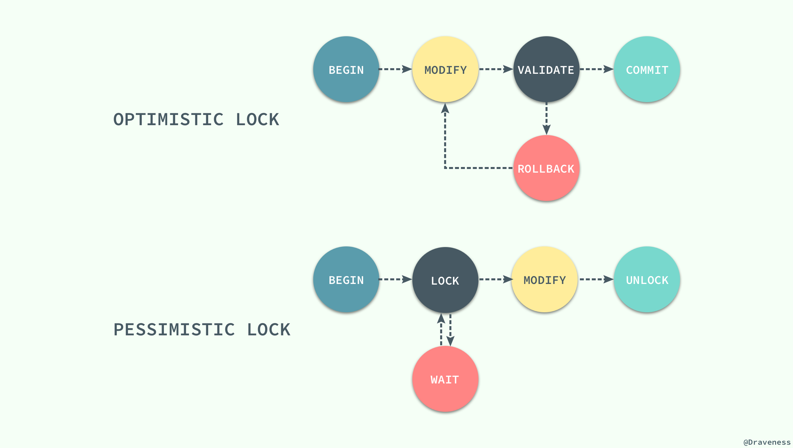

# 问题与简答

## MySQL 篇

### 体系结构

组成部分：SQL 接口，解析器，优化器，缓存，存储引擎


- Connectors：不同语言中与 SQL 的交互
- Management Serveices & Utilities： 系统管理和控制工具
- Connection Pool: 连接池
- SQL Interface: SQL 接口
- Parser: 解析器
- Optimizer: 查询优化器
- Cache 和 Buffer：查询缓存
- Engine：存储引擎

拓展阅读 [《MySQL体系结构》](./02.MySQL体系结构.md)

### 基础操作

#### 数据库管理

连接数据库、查看所有库、选择库、创建库、删除库

查看所有表、查看表结构、创建表、删除表

添加字段、删除字段、修改字段

#### CRUD

INSERT、SELECT、UPDATE、DELETE

#### 单表查询

所有字段、指定字段、WHERE、IN、BETWEEN AND、LIKE、AND、OR、DISTINCT、ORDER BY、GROUP BY、LIMIT

#### 多表查询

连接查询、子查询、合并结果

### 数据库设计范式

- 第一范式：属性具有原子性，不可再分解，即不能表中有表
- 第二范式：唯一性约束，每条记录有唯一标示，所有的非主键字段均需依赖于主键字段
- 第三范式：冗余性约束，非主键字段间不能相互依赖

### 数据库设计原则

- 避免冗余属性，冗余属性会带来数据不一致性
- 一个表只存储它应该存储的信息，和此表无关的信息放到另一个表去存储，表之间尽量解耦
- 一个字段中不要出现分隔符，或者在一个字段中存储多个信息

### char 和 varchar 数据类型区别

- char：擅于存储经常改变的值，或者长度相对固定的值。比如 type、ip 地址或 md5 之类的数据，不容易产生碎片
- varchar：善于存储值的长短不一的列，也是用的最多的一种类型，节省磁盘空间，保存可变长度字符串。这也是 innodb 官方推荐的类型

### LEFT JOIN 、RIGHT JOIN、INNER JOIN

- LEFT JOIN(左连接)：获取左表所有记录，即使右表没有对应匹配的记录
- RIGHT JOIN(右连接)： 与 LEFT JOIN 相反，用于获取右表所有记录，即使左表没有对应匹配的记录
- INNER JOIN(内连接)：获取两个表中字段匹配关系的记录

拓展阅读 [《MySQL 连接的使用》](./01.MySQL连接的使用.md)

### UNION、UNION ALL

- UNION 操作符用于连接两个以上的 SELECT 语句的结果组合到一个结果集合中。多个 SELECT 语句会删除重复的数据
- UNION ALL 操作符重复数据全部显示，不去重

### 常用 MySQL 函数

#### 数学函数

- floor(x) 返回不大于 x 的最大整数值
- ceil/ceiling(x) 返回不小于 x 的最小整数
- round(x) 四舍五入
- rand() 随机函数[0, 1)
- abs(x) 返回 x 的绝对值

#### 字符串函数

- concat(str1, str2, ...) 将参数连接成字符串返回
- length(str) 返回字符串长度

#### 日期和时间函数

- now() 当前时间
- curdate() 当前日期

```mysql
SELECT UNIX_TIMESTAMP('2019-05-07 22:55:00'); #1557240900
SELECT FROM_UNIXTIME(1557240900); #2019-05-07 22:55:00
```

#### 系统信息函数

- VERSION() 返回数据库的版本号
- LAST_INSERT_ID() 返回最后生成的 AUTO_INCREMENT 值

#### 加密函数

- PASSWORD(str) 对字符串 str 进行加密
- MD5(str) 对字符串 str 进行加密

#### 格式化函数

- FORMAT(x, n) 可以将数字 x 进行格式化，保留到小数点后 n 位，四舍五入

```mysql
SELECT FORMAT(2.7895, 2); #2.79
```

### 锁

#### 用途

多个查询需要在同一时刻修改数据，会产生并发控制的问题。使用锁可以有效解决这个问题

#### 乐观锁与悲观锁  

我们都知道锁的种类一般分为乐观锁和悲观锁两种，InnoDB 存储引擎中使用的就是悲观锁，而按照锁的粒度划分，也可以分成行锁和表锁。  

- 乐观锁是一种思想，它其实并不是一种真正的『锁』，它会先尝试对资源进行修改，在写回时判断资源是否进行了改变，如果没有发生改变就会写回，否则就会进行重试，在整个的执行过程中其实都没有对数据库进行加锁；
- 悲观锁就是一种真正的锁了，它会在获取资源前对资源进行加锁，确保同一时刻只有有限的线程能够访问该资源，其他想要尝试获取资源的操作都会进入等待状态，直到该线程完成了对资源的操作并且释放了锁后，其他线程才能重新操作资源；

虽然乐观锁和悲观锁在本质上并不是同一种东西，一个是一种思想，另一个是一种真正的锁，但是它们都是一种并发控制机制。



乐观锁不会存在死锁的问题，但是由于更新后验证，所以当冲突频率和重试成本较高时更推荐使用悲观锁，而需要非常高的响应速度并且并发量非常大的时候使用乐观锁就能较好的解决问题，在这时使用悲观锁就可能出现严重的性能问题；在选择并发控制机制时，需要综合考虑上面的四个方面（冲突频率、重试成本、响应速度和并发量）进行选择。

#### 读写锁

- 共享锁（读锁）：允许事务对一条行数据进行读取；
- 互斥锁（写锁,也叫排他锁）：允许事务对一条行数据进行删除或更新；

#### 锁粒度

- 表锁：开销最小，对表进行写操作，需要获得写锁，会阻塞该表的所有读写操作
- 行级锁：最大锁开销，可以最大程度地支持并发处理

拓展阅读 [《『浅入浅出』MySQL 和 InnoDB》](https://draveness.me/mysql-innodb/)


### 事务

事务就是一组原子性的 SQL 查询，或者说一个独立的工作单元。事务内的语句，要么全部执行成功，要么全部执行失败

ACID 特性：原子性(atomicity)、一致性(consistency)、隔离性(isolation)、持久性(durability)

#### 隔离级别

- 未提交读(READ UNCOMMITTED)：事务中的修改，未提交，其他事务也是可见

> `脏读`(Dirty Read)：事务读取未提交的数据

- 提交读(READ COMMITTED)：事务未提交，对自己可见，两次同样查询，可能得到不同结果

- 可重复读(REPEATABLE READ)：同一个事务多次读取结果一致。解决脏读问题

> MySQL 默认事务隔离级别

- 可串行化(SERIALIZABLE)：强制事务串行执行

#### 死锁

多个事务在同一资源上相互占用，并请求锁定对方占用资源，从而导致恶性循环的现象

InnoDB 目前处理方法：将持有最少行级排他锁的事务进行回滚

#### 事务日志

事务日志可以帮助提高事务的效率

#### MySQL 中的事务

MySQL 默认采用自动提交(AUTOCOMMIT)模式，每个查询都当作一个事务执行提交操作

### 常见存储引擎

#### InnoDB

- 很重要的存储引擎，很多个人和公司都对其贡献代码，而不仅仅是 Oracle 公司的开发团队
- 支持事务，行级锁，删除或者增加索引时不需要复制全表数据
- InnoDB 采用 MVCC 来支持高并发，实现了四个标准的隔离级别
- InnoDB 表是基于聚族索引建立的，聚族索引对主键查询有很高的性能
- InnoDB 内部做了很多优化，包括可预测性预读，加速读操作的自适应哈希索引，加速插入操作的插入缓冲区
- 作为事务性的存储引擎，InnoDB 通过一些机制和工具支持真正的热备份

#### MyISAM

- 不支持事务和行级锁，崩溃后无法安全恢复，表锁非常影响性能
- MyISAM 对整张表加锁，而不是针对行。读取时对需要读到的表加共享锁，写入则加排它锁。在表有读取查询的同事，也可以插入新记录(支持并发插入)
- 支持延迟更新索引健，极大的提升写入性能
- 支持全文索引，可以支持复杂的查询
- MyISAM 将表存储在两个文件中，数据文件和索引文件

### 常见索引

#### 索引概念

索引是存储引擎用于快速找到记录的一种数据结构

#### 索引分类


#### 索引创建

```mysql
ALTER TABLE `table_name` ADD INDEX index_name (`column`); #普通索引
```

```mysql
ALTER TABLE `table_name` ADD UNIQUE (`column`); #唯一索引
```

```mysql
ALTER TABLE `table_name` ADD PRIMARY KEY (`column`); #主键索引
```

```mysql
ALTER TABLE `table_name` ADD FULLTEXT (`column`); #全文索引
```

```mysql
ALTER TABLE `table_name` ADD INDEX index_name (`column1`, `column2`, `column3`); #组合索引
```

#### 索引区别

- 普通索引：最基本的索引，没有任何限制
- 唯一索引：与"普通索引"类似，不同的就是：索引列的值必须唯一，但允许有空值
- 主键索引：它是一种特殊的唯一索引，不允许有空值
- 全文索引：仅可用于 MyISAM 表，针对较大的数据，生成全文索引很耗时好空间
- 组合索引：为了更多的提高 MySQL 效率可建立组合索引，遵循"最左前缀"原则

### 聚族索引与非聚族索引的区别

- 按物理存储分类：聚簇索引(clustered index)、非聚簇索引(non-clustered index)
- 聚簇索引的叶子节点就是数据节点，而非聚簇索引的叶子节点仍然是索引节点，只不过有指向对应数据块的指针

### BTree 与 BTree-/BTree+ 索引原理

- BTree

二叉树导致树高度非常高，逻辑上很近的节点，物理上非常远，无法利用局部性，IO 次数多，查找效率低

- BTree-

每个节点都是二元数组[key,data]，所有节点都可以存储数据，key 为索引，data 为索引外的数据。插入删除数据会破坏 BTree 性质，插入数据时候，需要对数据进行分裂、合并、转移等操作保持 BTree 性质，造成 IO 操作频繁

- BTree+

非叶子节点不存储 data，只存储索引 key，只有叶子节点才存储 data

- MySQL中的 BTree+

在经典 BTree+ 的基础上进行了优化，增加了顺序访问指针。在 BTree+ 的每个叶子节点增加了一个指向相邻叶子节点的指针，形成了带顺序访问指针的 BTree+，提高了区间访问性能

### 分表数量级

MySQL 单表容量在`500万`左右，性能处于最佳状态，此时，MySQL 的 BTREE 索引树高在3～5之间

### EXPLAIN 输出格式

|Column|JSON Name|含义|
|-|-|-|
|id|select_id|SELECT 标识符|
|select_type|None|SELECT 类型|
|table|table_name|输出行描述的表的表名|
|partitions|partitions|匹配的分区|
|type|access_type|连接类型|
|possible_keys|possible_keys|可供选择使用的索引|
|key|key|实际使用的索引|
|key_len|key_length|实际使用的索引的长度|
|ref|ref|与索引进行比较的列，也就是关联表使用的列|
|rows|rows|将要被检查的估算的行数|
|filtered|filtered|被表条件过滤的行数的百分比|
|Extra|None|附件信息|

### my.cnf 配置

### 慢查询
